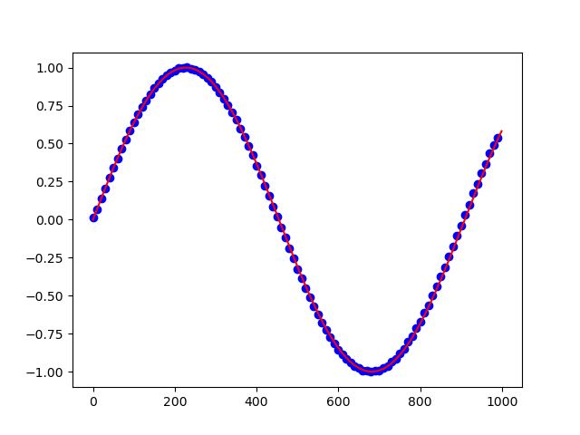

Downsampling
============

.. currentmodule:: basic.downsampling
.. autofunction:: run

The following code example shows how to apply downsampling.

.. code:: python
    
   def main():
      #Configure sample data
      channel_count = 1
      frequency = [random.randint(10, 25) for _ in range(channel_count)]
      data_range = np.arange(0, 1000)
      frequency_sampling = 10000
      frequency_downsampled = 1000
      
      #Generate some sample data
      raw_data = [None for _ in range(channel_count)]
      for idx in range(channel_count):
        genuine_signal = np.sin(2 * np.pi * frequency[idx] * data_range / frequency_sampling)
        
        raw_data[idx] = genuine_signal
      raw_data = np.asarray(raw_data)
        
      ds_data = ds.run(raw_data[0], frequency_sampling, frequency_downsampled)
      
      #visualize result
      plt.figure()
      
      plt.plot(np.arange(0, len(data_range), 1), raw_data[0], color = "red")
      plt.scatter(np.arange(0, len(data_range), frequency_sampling/frequency_downsampled), ds_data, color = "blue")
      plt.show(block = True)
    
   main()

Applying downsampling reduced the high-density red line to the data points identified by the blue dots:
    

