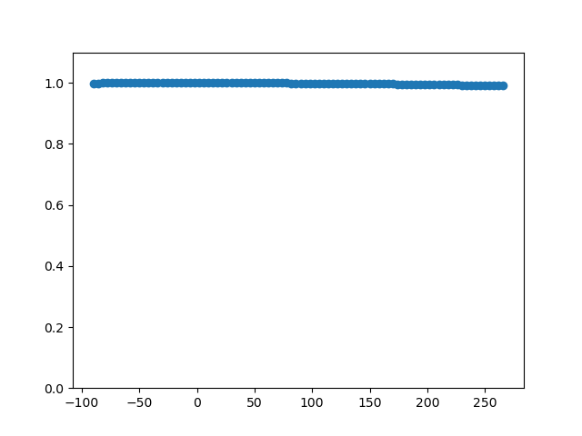

.. _msc_module:

Magnitude squared coherence
===========================

This function may be called for data in the time domain, the frequency domain, or (if correctly aligned) in the complex coherency domain.

.. note:: Use the following function for time domain data.

.. currentmodule:: feat.sfc
.. autofunction:: msc

.. note:: Use the following function for frequency domain data.

.. currentmodule:: feat.sfc
.. autofunction:: msc

.. note:: Use the following function for complex coherency domain data.

.. currentmodule:: feat.sfc
.. autofunction:: msc

The following code example shows how to apply magnitude squared coherence to measure sfc.

.. code-block:: python
    
   import numpy as np

   import matplotlib.pyplot as plt

   import finnpy.feat.sfc as sfc  # @UnresolvedImport
   import finnpy.demo.functionality.sfc.gen_demo_data as gen_demo_data  # @UnresolvedImport

   def main():
      minimum_frequency = 13
      maximum_frequency = 27
      
      frequency_sampling = 2000
      time_s = 120
      offset_s = 1
      signal_length_samples = int(frequency_sampling * (time_s + offset_s * 2)) 
      data = gen_demo_data.gen_wn_signal(minimum_frequency, maximum_frequency, frequency_sampling, signal_length_samples)
      frequency_peak = (maximum_frequency + minimum_frequency)/2
      
      noise_weight = 0.2
      
      phase_min = -90
      phase_max = 270
      phase_step = 4
      
      frequency_target = 20
      nperseg = frequency_sampling
      nfft = frequency_sampling
      
      #Generate data
      offset = int(np.ceil(frequency_sampling/frequency_peak))
      loc_data = data[offset:]
      signal_1 = np.zeros((loc_data).shape)
      signal_1 += loc_data
      signal_1 += np.random.random(len(loc_data)) * noise_weight
      
      conn_vals = list()
      fig = plt.figure()
      for phase_shift in np.arange(phase_min, phase_max, phase_step):
         loc_offset = offset - int(np.ceil(frequency_sampling/frequency_peak * phase_shift/360))
         loc_data = data[(loc_offset):]
         signal_2 = np.zeros(loc_data.shape)
         signal_2 += loc_data
         signal_2 += np.random.random(len(loc_data)) * noise_weight
         
         plt.cla()
         plt.plot(signal_1[:500], color = "blue")
         plt.plot(signal_2[:500], color = "red")
         plt.title("Signal shifted by %2.f degree around %2.2fHz" % (float(phase_shift), float(frequency_peak)))
         plt.show(block = False)
         plt.pause(0.001)
          
         conn_value_td = calc_from_time_domain(signal_1, signal_2, frequency_sampling, nperseg, nfft, frequency_target)
         conn_value_fd = calc_from_frequency_domain(signal_1, signal_2, frequency_sampling, nperseg, nfft, frequency_target)
         conn_value_coh = calc_from_coherency_domain(signal_1, signal_2, frequency_sampling, nperseg, nfft, frequency_target)
         
         if (np.isnan(conn_value_td) == False and np.isnan(conn_value_fd) == False and np.isnan(conn_value_coh) == False):
            if (conn_value_td != conn_value_fd or conn_value_td != conn_value_coh):
               print("Error")
          
         conn_vals.append(conn_value_td if (np.isnan(conn_value_td) == False) else 0)
      
      plt.close(fig)
      
      plt.figure()
      plt.scatter(np.arange(phase_min, phase_max, phase_step), conn_vals)
      plt.ylim((0, 1.1))
      plt.show(block = True)
      
      
   def calc_from_time_domain(signal_1, signal_2, frequency_sampling, nperseg, nfft, frequency_target):
      return sfc.msc_td(signal_1, signal_2, frequency_sampling, nperseg, nfft)[1][frequency_target]

   def calc_from_frequency_domain(signal_1, signal_2, frequency_sampling, nperseg, nfft, frequency_target):
      seg_data_X = sfc._segment_data(signal_1, nperseg, pad_type = "zero")  # pylint: disable=protected-access
      seg_data_Y = sfc._segment_data(signal_2, nperseg, pad_type = "zero")  # pylint: disable=protected-access

      (bins, fd_signal_1) = sfc._calc_FFT(seg_data_X, frequency_sampling, nfft, window = "hanning")  # pylint: disable=protected-access
      (_,    fd_signal_2) = sfc._calc_FFT(seg_data_Y, frequency_sampling, nfft, window = "hanning")  # pylint: disable=protected-access
      
      return sfc.msc_fd(fd_signal_1, fd_signal_2, bins)[1][[np.argmin(np.abs(bins - frequency_target))]]
          
   def calc_from_coherency_domain(signal_1, signal_2, frequency_sampling, nperseg, nfft, frequency_target):
      (bins, coh) = sfc.cc_td(signal_1, signal_2, nperseg, "zero", frequency_sampling, nfft, "hanning")
      
      return sfc.msc_cc(coh)[np.argmin(np.abs(bins - frequency_target))]
      
      
   main()

Magnitude squared coherence is a very robust, but directionless, metric of coherence which is does not distinguish between real connectivity and volume conduction. 
    

