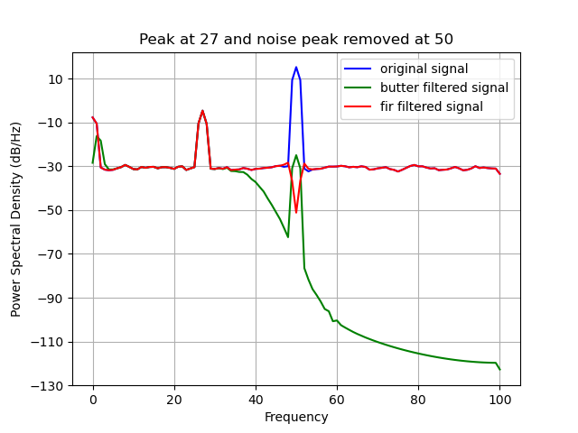

FIR filter
==========

.. currentmodule:: filters.frequency
.. autofunction:: fir

The following code example shows how to apply the FIR filter.

.. code:: python
    
   import numpy as np
   import random

   import matplotlib
   matplotlib.use("Qt5agg")
   import matplotlib.pyplot as plt

   import finn.filters.frequency as ff

   #Configure sample data
   channel_count = 1
   frequency = [random.randint(5, 50) for _ in range(channel_count)]
   data_range = np.arange(0, 10000)
   frequency_sampling = 200

   #Configure noise data
   frequency_noise = 50
   shared_noise_strength = 10
   random_noise_strength = 1

   #Generate some sample data
   raw_data = [None for _ in range(channel_count)]
   for ch_idx in range(channel_count):
       genuine_signal = np.sin(2 * np.pi * frequency[ch_idx] * data_range / frequency_sampling)
       shared_noise_signal = np.sin(2 * np.pi * frequency_noise * data_range / frequency_sampling) * shared_noise_strength
       random_noise_signal = np.random.random(len(data_range)) * random_noise_strength
       
       raw_data[ch_idx] = genuine_signal + shared_noise_signal + random_noise_signal
   raw_data = np.asarray(raw_data)

   #Filter data - butter
   filtered_butter_data = [None for _ in range(channel_count)]    
   for ch_idx in range(channel_count):
       filtered_butter_data[ch_idx] = ff.butter(raw_data[ch_idx], 1, 40, frequency_sampling, order = 7, zero_phase = True)
   filtered_butter_data = np.asarray(filtered_butter_data)

   #Filter data - fir
   filtered_fir_data = [None for _ in range(channel_count)]    
   for ch_idx in range(channel_count):
       filtered_fir_data[ch_idx] = ff.fir(raw_data[ch_idx], 52, 48, 0.1, frequency_sampling, ripple_pass_band = 1e-5, stop_band_suppression = 1e-7, fft_win_sz = frequency_sampling, pad_type = "zero")
   filtered_fir_data = np.asarray(filtered_fir_data)

   #visualize result
   plt.title("Peak at %i and noise peak removed at %i" % (frequency[0], frequency_noise))
   plt.psd(raw_data[0, :], NFFT = frequency_sampling, Fs = frequency_sampling, color = "blue", label = "original signal")
   plt.psd(filtered_butter_data[0, :], NFFT = frequency_sampling, Fs = frequency_sampling, color = "green", label = "butter filtered signal")
   plt.psd(filtered_fir_data[0, :], NFFT = frequency_sampling, Fs = frequency_sampling, color = "red", label = "fir filtered signal")
   plt.legend()

   plt.show(block = True)

Applying the FIR filter (red) notched the noise at 50Hz.
    

