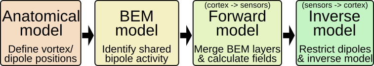

.. _src_rec_main_label:

Model computation & application
===============================

This guide explains how to apply source reconstruction for M/EEG using FiNNPy.

Anatomical model processing
---------------------------

The skull model is a geometrical description of the skull surface. For MEG, a single layer model suffices, EEG requires a 3-layer model. The anatomical models is derived from T1 scans and extracted using the watershed algorithm of FreeSurfer. The model's density is reduced to increase computability and mathematical stability. 

BEM model processing
--------------------

From this anatomical model, virtual dipoles are placed at every vortex. The boundary element method (BEM) is employed to calculate how much information is shared between a vortex (of the uni/multi layered head model polygon) and other vertices in the vicinity. 

Forward model computation
-------------------------

Having established the relationship between the virtual dipoles, this information is merged with the scans of the cortical surface to calculate the electrical activity expected at a M/EEG sensor. To reduce the degrees of freedom, dipoles in the forward model are restricted to an orthogonal orientation. Inversion of the forward model enables the projection from sensor to source space. 

Application
-----------

An application example of source reconstruction for M/EEG is provided below. Generally, source reconstruction may be divided into five steps, 
1. Device specific steps
2. Subject specific steps
3. Recording specific steps
4. Model application
5. Group space (fs-average) and atlas transformation

The following sections will provide examples on how to install FreeSurfer

0. :ref:`src_rec_install_label`

and apply FiNNpy to execute these steps.

1. :ref:`src_rec_anatomy_label`
2. :ref:`src_rec_sensors_label`
3. :ref:`src_rec_downstream_label`
4. :ref:`src_rec_apply_label`
5. :ref:`src_rec_fs_avg_proj_label`

Pitfalls
--------

Potential pitfalls in source reconstruction are discussed in :ref:`src_rec_pitfalls_label`.

Speed-ups
---------

Provided code to build binaries to speed up processing are discussed in :ref:`_src_rec_ext_speedup_label`.
