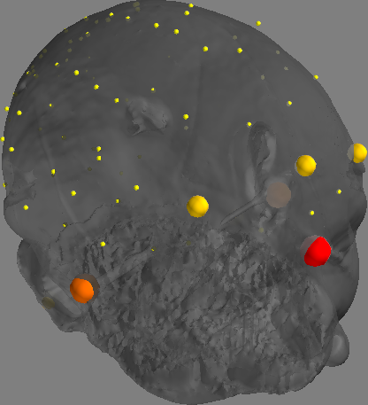
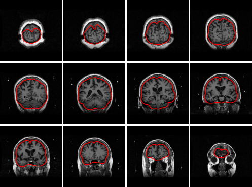

.. _src_rec_pitfalls_label:

Likely pitfalls
===============

This guide explains how to deal with likely pitfalls in source reconstruction for MEG using FiNNPy.

MEG and MRI coregistration
--------------------------

Correctness of the coregistration between the MEG and MRI should be manually verified. This may be done as follows:

.. code-block::

  rec_meta_info = mne.io.read_info(data_path)
  meg_ref_pts = finnpy.src_rec.coreg.load_meg_ref_pts(rec_meta_info)
  (coreg, bad_hsp_pts) = finnpy.src_rec.coreg.run(subj_name, anatomy_path, rec_meta_info)
  finnpy.src_rec.coreg.plot_coregistration(coreg, meg_ref_pts, bad_hsp_pts, anatomy_path, subj_name)
       
Producing the following output:

Improper skull model
--------------------

Correctness of the anatomy extraction should be manually verified. This may be done as follows:

.. code-block::

  skull_skin_mdl = finnpy.src_rec.skull_skin_mdls.read(anatomy_path, subj_name, "MEG")
  finnpy.src_rec.skull_skin_mdls.plot(skull_skin_mdl, anatomy_path, subj_name)
       
Producing the following output:

Sensor noise covariance
-----------------------

A faulty sensor covariance matrix may also adversely affect the reconstruction effort. Unlike with the coregistration, this is most easily spotted toward
the end of the reconstruction effort. Namely, by adding an artificially introduced power spike to well-chosen single sensor-space channel and observing the
projection of this effect onto source space. As such, if e.g. a motor channel was chosen, the projected effect should appear above the motor cortex. 

.. code-block::

  sen_data[ch_names.index("C4"), :] += 10000
  color_data = np.mean(np.abs(src_data), axis = 1)
  (coreg, _) = finnpy.src_rec.coreg.run(SUBJ_NAME, ANATOMY_PATH, "EEG", rec_info = "1020")
  [...] # Here comes the full reconstruction pipeline.
  src_data = finnpy.src_rec.inv_mdl.apply(sen_data, inv_mdl)
  psr.plot_subj_space(cort_mdl, color_data, "EEG", ["1020", ch_names], coreg, ch_names)

Alternatively, multiple files for a sensor noise covariance may be acquired and the resulting projections compared.

