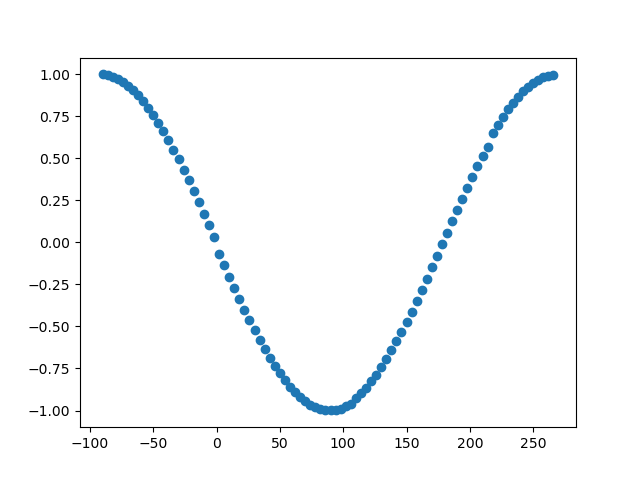

Imaginary coherence
===================

This function may be called for data in the time domain, the frequency domain, or (if correctly aligned) in the complex coherency domain.

.. note:: Use the following function for time domain data.

.. currentmodule:: sfc.td
.. autofunction:: run_ic

.. note:: Use the following function for frequency domain data.

.. currentmodule:: sfc.fd
.. autofunction:: run_ic

.. note:: Use the following function for complex coherency domain data.

.. currentmodule:: sfc.cd
.. autofunction:: run_ic

The following code example shows how to apply imaginary coherence to measure sfc.

.. code:: python
    
   import numpy as np

   import matplotlib
   matplotlib.use("Qt5agg")
   import matplotlib.pyplot as plt

   import finn.sfc.td as td
   import finn.sfc.fd as fd
   import finn.sfc.cd as cohd

   import finn.sfc._misc as misc
   import demo_data.demo_data_paths as paths

   def main():
       data = np.load(paths.fct_sfc_data)
       frequency_sampling = 5500
       frequency_peak = 30
       
       noise_weight = 0.2
       
       phase_min = -90
       phase_max = 270
       phase_step = 4
       
       frequency_target = 30
       nperseg = frequency_sampling
       nfft = frequency_sampling
       
       #Generate data
       offset = int(np.ceil(frequency_sampling/frequency_peak))
       loc_data = data[offset:]
       signal_1 = np.zeros((loc_data).shape)
       signal_1 += loc_data
       signal_1 += np.random.random(len(loc_data)) * noise_weight
       
       conn_vals = list()
       fig = plt.figure()
       for phase_shift in np.arange(phase_min, phase_max, phase_step):
           loc_offset = offset - int(np.ceil(frequency_sampling/frequency_peak * phase_shift/360))
           loc_data = data[(loc_offset):]
           signal_2 = np.zeros(loc_data.shape)
           signal_2 += loc_data
           signal_2 += np.random.random(len(loc_data)) * noise_weight
           
           plt.cla()
           plt.plot(signal_1[:500], color = "blue")
           plt.plot(signal_2[:500], color = "red")
           plt.title("Signal shifted by %2.f degree around %2.2fHz" % (float(phase_shift), float(frequency_peak)))
           plt.show(block = False)
           plt.pause(0.001)
           
           conn_value_td = calc_from_time_domain(signal_1, signal_2, frequency_sampling, nperseg, nfft, frequency_target)
           conn_value_fd = calc_from_time_domain(signal_1, signal_2, frequency_sampling, nperseg, nfft, frequency_target)
           conn_value_coh = calc_from_time_domain(signal_1, signal_2, frequency_sampling, nperseg, nfft, frequency_target)
           
           if (np.isnan(conn_value_td) == False and np.isnan(conn_value_fd) == False and np.isnan(conn_value_coh) == False):
               if (conn_value_td != conn_value_fd or conn_value_td != conn_value_coh):
                   print("Error")
           
           conn_vals.append(conn_value_td if (np.isnan(conn_value_td) == False) else 0)
       
       plt.close(fig)
       
       plt.figure()
       plt.scatter(np.arange(phase_min, phase_max, phase_step), conn_vals)
       plt.show(block = True)
       
       
   def calc_from_time_domain(signal_1, signal_2, frequency_sampling, nperseg, nfft, frequency_target):
       return td.run_ic(signal_1, signal_2, frequency_sampling, nperseg, nfft)[1][frequency_target]

   def calc_from_frequency_domain(signal_1, signal_2, frequency_sampling, nperseg, nfft, frequency_target):
       seg_data_X = misc._segment_data(signal_1, nperseg, pad_type = "zero")
       seg_data_Y = misc._segment_data(signal_2, nperseg, pad_type = "zero")

       (bins, fd_signal_1) = misc._calc_FFT(seg_data_X, frequency_sampling, nfft, window = "hanning")
       (_,    fd_signal_2) = misc._calc_FFT(seg_data_Y, frequency_sampling, nfft, window = "hanning")
       
       return fd.run_ic(fd_signal_1, fd_signal_2)[1][[np.argmin(np.abs(bins - frequency_target))]]
           
   def calc_from_coherency_domain(signal_1, signal_2, frequency_sampling, nperseg, nfft, frequency_target):
       (bins, coh) = td.run_cc(signal_1, signal_2, nperseg, "zero", frequency_sampling, nfft, "hanning")
       
       return cohd.run_ic(coh)[np.argmin(np.abs(bins - frequency_target))]
       
       
   main()

The maximum score of imaginary coherence is dependent on the phase shift between two signals, hence it can only be interpreted relatively and never absolutely. 
    

