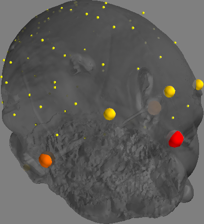
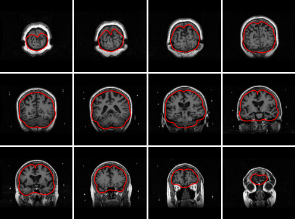

.. _source_reconstruction_label:

Source reconstruction
=====================

This guide explains how to apply source reconstruction for MEG using FiNNPy.

.. image:: img/MEG_source_reconstruction_simplified.png
   :alt: Graphic presentation of the relationship between skull & cortical model
   :align: center

Skull model processing
----------------------

The skull model is a geometrical description of the skull surface. For MEG analyses, a single layer model suffices (option for EEG source reconstruction to be added soon). The skull model is derived from T1 scans and extracted using the watershed algorithm of FreeSurfer. Its density is reduced to increase computeability and mathematical stability. Herein, it is employed to project MEG data from sensor space onto the skull surface.

Cortex model processing
-----------------------
The cortical model is a geometric description of the cortical structure. The cortical model may be directly extracted (using FreeSurfer) from T1 scans. Akin to the skull model, its density is reduced to increase computeability and mathematical stability. Herein, it will be employed to MEG activity from the skull surface onto the cortex proper.

Skull and cortex model fusion
-----------------------------
Skull and cortical models are fused to create the forward model. While the skull model describes the transition from sensor space to skull space, the cortex model may be employed to transition further into cortical space.

Application
-----------

An application example of source reconstruction for MEG is provided below. Generally, source reconstruction may be divivided into three steps, 
1. T1/MRI scan data extraction
2. Model computation
3. Model application

The following sections will provide examples on how to apply finnpy to execute these steps

T1/MRI scan data extraction
^^^^^^^^^^^^^^^^^^^^^^^^^^^

Initially, free surfer paths need to be configured for subsequent freesurfer calls.

.. code-block::

       print("Setting up freesurfer paths")
       finnpy.source_reconstruction.utils.init_fs_paths(PATH + folder + "/anatomy/")
       

Subsequently, freesurfer may be used to either extract anatomical information from subject specific MRI scans or copy data from fs-average, an averaged MRI scan provided through freesurfer.

.. code-block::

       print("Extract anatomy")
       if (t1_scan_file is None):
           finnpy.source_reconstruction.mri_anatomy.copy_fs_avg_anatomy(fs_path, subj_path, subj_name)
       else:
           finnpy.source_reconstruction.mri_anatomy.extract_anatomy_from_mri_using_fs(subj_name, t1_scan_path + subj_name + "/pre/" + t1_scan_file, overwrite = True)

Model computation
^^^^^^^^^^^^^^^^^

After freesurfer has extracted/copied the necessary files, the inverse model may be computed. In this example, the transformation from subject specific into fs-average space will be computed alongside. The projection into a common space is needed for group level analyses.

In a first step, meta information from the respective MEG file is read and (if need be), freesurfer paths initialized.

.. code-block::

       rec_meta_info = mne.io.read_info(data_path)
       finnpy.source_reconstruction.utils.init_fs_paths(loc_fs_path)

Afterwards, MEG and MRI recordings are coregistered. The resulting covariance is employed to scale MRI files, and returned in rigid (without scaling) form for transformations in both directions, MEG to MRI and MRI to MEG.

.. code-block::
           
       (coreg_rotors, meg_pts) = finnpy.source_reconstruction.coregistration_meg_mri.calc_coreg(subj_name, subj_path, rec_meta_info, registration_scale_type = "free")
       rigid_mri_to_head_trans = finnpy.source_reconstruction.coregistration_meg_mri.get_rigid_transform(coreg_rotors)
        
       finnpy.source_reconstruction.mri_anatomy.scale_anatomy(subj_path, subj_name, coreg_rotors[6:9])

       rigid_mri_to_meg_trans = finnpy.source_reconstruction.coregistration_meg_mri.get_rigid_transform(coreg_rotors)
       rigid_meg_to_mri_trans = scipy.linalg.inv(rigid_mri_to_meg_trans)

To investigate whether the covariance has been correctly extracted, the result of this operation may be visualized via FinnPy and subsequently manually confirmed.

.. code-block::

       print("Visualizing coregistration")
       finnpy.source_reconstruction.coregistration_meg_mri.plot_coregistration(rigid_mri_to_head_trans, rec_meta_info, meg_pts, fs_path, subj_name)

The next step is to employ the watershed algorithm of FreeSurfer to extract inner skull, outer skull and outer skin models. As this example details a MEG reconstruction, only the inner skull model is needed.

.. code-block::

       (in_skull_vert, in_skull_faces,
        out_skull_vert, out_skull_faces,
        out_skin_vect, out_skin_faces) = get_skin_skull_model(fs_subj_path, subj_name + rec_folder, visualize_skull_skin_plots)
       del out_skull_vert; del out_skull_faces; del out_skin_vect; del out_skin_faces

With these models, the BEM (boundary elements model) is computed.

.. code-block::

       print("Calculating BEM model")
       (in_skull_reduced_vert, in_skull_faces, 
        in_skull_faces_area, in_skull_faces_normal, 
        bem_solution) = finnpy.source_reconstruction.bem_model.calc_bem_model_linear_basis(in_skull_vert, in_skull_faces)

This concludes the skull model specific parts. To prepare cortical models, those are loaded and downscaled accordingly.
       
.. code-block::

       (lh_white_vert, lh_white_faces,
       rh_white_vert, rh_white_faces,
       lh_sphere_vert,
       rh_sphere_vert) = finnpy.source_reconstruction.utils.read_surface_model(fs_subj_path)
       (octa_model_vert, octa_model_faces) = finnpy.source_reconstruction.source_mesh_model.create_source_mesh_model()
       (lh_white_valid_vert, rh_white_valid_vert) = finnpy.source_reconstruction.source_mesh_model.match_source_mesh_model(lh_sphere_vert, rh_sphere_vert, octa_model_vert)

This concludes the cortical surface model specific parts. The next step is to calculate the forward model, fusing information from the skull and cortical models

.. code-block::

       (fwd_sol,
        lh_white_valid_vert, rh_white_valid_vert) = finnpy.source_reconstruction.forward_model.calc_forward_model(lh_white_vert, rh_white_vert, rigid_meg_to_mri_trans, rigid_mri_to_meg_trans, rec_meta_info, in_skull_reduced_vert, in_skull_faces, in_skull_faces_normal, in_skull_faces_area, bem_solution, lh_white_valid_vert, rh_white_valid_vert)

Afterwards, the cortical model is optimized.

.. code-block::

       print("Optimize forward model orientation")
       optimized_fwd_sol = finnpy.source_reconstruction.forward_model.optimize_fwd_model(lh_white_vert, lh_white_faces, lh_white_valid_vert, rh_white_vert, rh_white_faces, rh_white_valid_vert, fwd_sol, rigid_mri_to_meg_trans)

And the sensor covariance matrix calculated.

.. code-block::

       print("Calculate sensor covariance")
       (sensor_cov_eigen_val, sensor_cov_eigen_vec, sensor_cov_names) = finnpy.source_reconstruction.sensor_covariance.get_sensor_covariance(file_path = SENSOR_COV_PATH, cov_path = loc_fs_path + "cov_data/", overwrite = overwrite_sensor_cov)

Employing the sensor covariance matrix, the forward model may be inverted into the inverse model.

.. code-block::

       print("Calculate inverse model")
       (inv_trans, noise_norm) = finnpy.source_reconstruction.inverse_model.calc_inverse_model(sensor_cov_eigen_val, sensor_cov_eigen_vec, sensor_cov_names, optimized_fwd_sol, rec_meta_info)

Additionally, herein we compute a source level transformation from subject source space to fs-average source space for later group level analyses.

.. code-block::

       print("Calculate transformation to fs-average")
       (fs_avg_trans_mat, src_fs_avg_valid_lh_vert, src_fs_avg_valid_rh_vert) = finnpy.source_reconstruction.utils.get_mri_subj_to_fs_avg_trans_mat(lh_white_valid_vert, rh_white_valid_vert, octa_model_vert, fs_subj_path, loc_fs_path + "fsaverage/", overwrite = overwrite_mri_trans)

Important factors
-----------------

This section lists common pitfalls where unexperienced users may proceed despite improper data processing results.

MEG and MRI coregistration
^^^^^^^^^^^^^^^^^^^^^^^^^^
The coregistration between MEG and MRI space has been left unchecked. This step must be manually verified. This may be done as follows:

.. code-block::
       
       finnpy.source_reconstruction.coregistration_meg_mri.plot_coregistration(rigid_mri_to_meg_trans, rec_meta_info, meg_pts, fs_subj_path)
       
Producing the following output:

Sensor noise covariance
^^^^^^^^^^^^^^^^^^^^^^^
The sensor noise covariance is faulty. This may be investigated by adding a power spike to a sensor-space channel and investigate where it is projected.

Improper skull model
^^^^^^^^^^^^^^^^^^^^
The skull model was improperly extracted. This step must be manually verified.  This may be done as follows:

.. code-block::
       
       (ws_in_skull_vert, ws_in_skull_faces, 
        ws_out_skull_vert, ws_out_skull_faces,
        ws_out_skin_vect, ws_out_skin_faces) = finnpy.source_reconstruction.bem_model.read_skull_and_skin_models(fs_subj_path, subj_name + rec_folder)
       
       finnpy.source_reconstruction.bem_model.plot_skull_and_skin_models(ws_in_skull_vert, ws_in_skull_faces,
                                                                         ws_out_skull_vert, ws_out_skull_faces,
                                                                         ws_out_skin_vect, ws_out_skin_faces,
                                                                         fs_subj_path)
       
Producing the following output:

