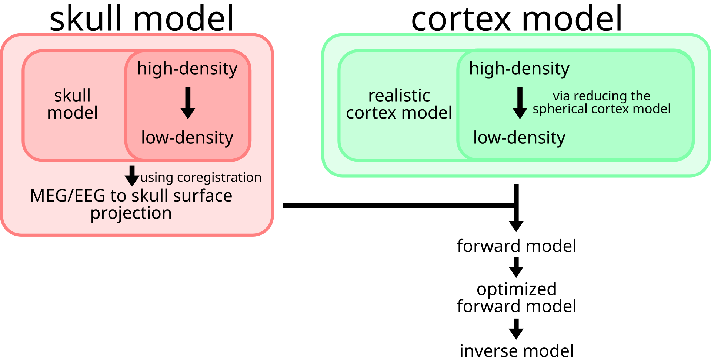

.. _source_reconstruction_main_label:

Model computation & application
===============================

This guide explains how to apply source reconstruction for MEG using FiNNPy.

Skull model processing
----------------------
The skull model is a geometrical description of the skull surface. For MEG analyses, a single layer model suffices (option for EEG source reconstruction to be added soon). The skull model is derived from T1 scans and extracted using the watershed algorithm of FreeSurfer. Its density is reduced to increase computeability and mathematical stability. Herein, it is employed to project MEG data from sensor space onto the skull surface.

Cortex model processing
-----------------------
The cortical model is a geometric description of the cortical structure. The cortical model may be directly extracted (using FreeSurfer) from T1 scans. Akin to the skull model, its density is reduced to increase computeability and mathematical stability. Herein, it will be employed to MEG activity from the skull surface onto the cortex proper.

Skull and cortex model fusion
-----------------------------
Skull and cortical models are fused to create the forward model. While the skull model describes the transition from sensor space to skull space, the cortex model may be employed to transition further into cortical space.

Application
-----------

An application example of source reconstruction for MEG is provided below. Generally, source reconstruction may be divivided into three steps, 
1. Generalist model computation
2. Model specialization
3. Model application

The following sections will provide examples on how to install FreeSurfer

1. :ref:`_source_reconstruction_installation_label`

and  apply finnpy to execute these steps.

2. :ref:`_source_reconstruction_general_label`
3. :ref:`_source_reconstruction_specific_label`
4. :ref:`_source_reconstruction_application_label`

Additionally, likely pitfalls in source reconstruction are discussed in :ref:`_source_reconstruction_pitfalls_label`.

