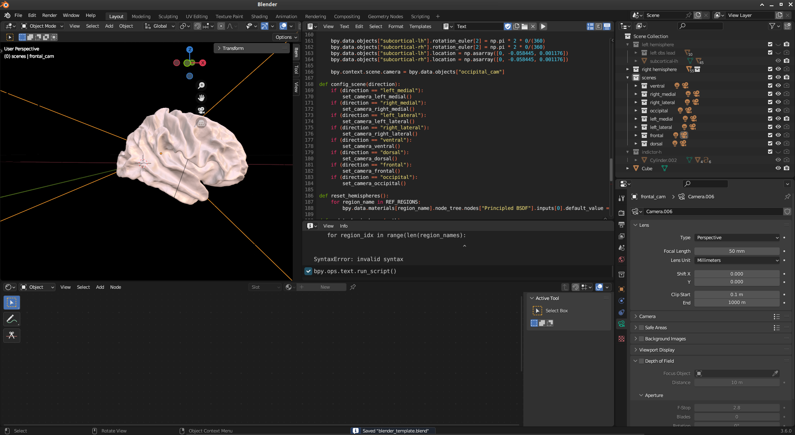

.. _src_rec_vis_label:

Visualization
=============

This guide explains how to visualize source reconstructed results using Blender.

Background: Blender
-------------------

Blender is an open source and free available software suite for 3D visualization & animation. It is available at https://www.blender.org/.

Visualization guide
-------------------

Results source-reconstructed via FinnPy may be either (almost) directly visualized in blender or after subsequent postprocessing (e.g. power estimation, connectivity estimation). The following code will be employed to visualize results in blender. It provides a number of pre-configured perspectives, but images may be rendered from any freely chosen perspective.

Important
^^^^^^^^^

Unlike other functionality of this framework, this code has to be executed from within blender, as explained below. A blender template file (blender_template) is provided within the github repository.

Executing Python code in Blender
^^^^^^^^^^^^^^^^^^^^^^^^^^^^^^^^

To execute Python code from within blender, a text window needs to be opened within blender (either in the main or a *swiped in* window). Code within this window is executed by pressing the rightwards pointing triangle. 

Code explanation
^^^^^^^^^^^^^^^^

The code will have to be subtly adapted to use, as usual.

Initially, supportive functions are defined. The call to *reset_hemispheres* resets all nodes to an equal color, defined by the RGBA tuple (1, .738, .665, 1).

.. code-block::

       import numpy as np
       import bpy
       import os
      
       [...] # See detailed section below.
      
       def reset_hemispheres():
           for region_name in REF_REGIONS:
               bpy.data.materials[region_name].node_tree.nodes["Principled BSDF"].inputs[0].default_value = tuple(np.asarray([1, .738, .665, 1]).tolist())

In this example, effect sizes of significant results are visualized. To this end, *update_hemisphere* is provided with a path to an array/list with significance values, effect size values, and region names. The region names correspond to those earlier established in the source reconstruction. Subsequently, regions are colored where a stronger cyan coloring indicates a stronger effect and vice versa.

.. code-block::
       
       def update_hemispheres(path):
           sign_data = np.load(path + "_sign.npy")
           eff_sz_data = np.load(path + "_eff_sz.npy")
           region_names = np.load(path + "ref_regions.npy")
           
           eff_sz_data -= np.min(eff_sz_data)
           eff_sz_data /= np.max(eff_sz_data)
           
           for region_idx in range(len(region_names):
               if (sign_data[region_idx] == False):
                   continue
               
               color = np.asarray([0 * eff_sz_data[region_idx], 222/255 * eff_sz_data[region_idx], 255/255 * eff_sz_data[region_idx], 1])
               
               region_name = region_names[region_idx]
               bpy.data.materials[region_name].node_tree.nodes["Principled BSDF"].inputs[0].default_value = tuple(color.tolist())
       
       def draw_scene(path):
           reset_hemispheres()
           update_hemispheres(path)
           
Finally, the resulting image is rendered and the image saved into a predefined location.
           
.. code-block::
       
       def save_scene(hypothesis, direction):
           bpy.context.scene.render.filepath = OUTPATH
           bpy.ops.render.render(write_still = True)
       
For conviencence, these methods may be formatted and called as follows:
       
.. code-block::      
       
       DIRECTIONS = ["left_medial", "right_medial", "left_lateral", "right_lateral", "ventral", "dorsal", "frontal", "occipital"]
       
       INPATH = ""
       OUTPATH = ""
       
       config_scene("left_medial")
       draw_scene(INPATH)
       #save_scene(OUTPATH)
       
       print("terminated successfully")
       
.. collapse:: Details
       
       Functionality employed to change perspective.
       
       .. code-block::

              import numpy as np
              import bpy
              import os

              REF_REGIONS = ["bankssts-lh", "caudalanteriorcingulate-lh", "caudalmiddlefrontal-lh", "cuneus-lh", "entorhinal-lh", "frontalpole-lh", "fusiform-lh", "inferiorparietal-lh", "inferiortemporal-lh", "insula-lh", "isthmuscingulate-lh", "lateraloccipital-lh", "lateralorbitofrontal-lh", "lingual-lh", "medialorbitofrontal-lh", "middletemporal-lh", "paracentral-lh", "parahippocampal-lh", "parsopercularis-lh", "parsorbitalis-lh", "parstriangularis-lh", "pericalcarine-lh", "postcentral-lh", "posteriorcingulate-lh", "precentral-lh", "precuneus-lh", "rostralanteriorcingulate-lh", "rostralmiddlefrontal-lh", "superiorfrontal-lh", "superiorparietal-lh", "superiortemporal-lh", "supramarginal-lh", "temporalpole-lh", "transversetemporal-lh", "bankssts-rh", "caudalanteriorcingulate-rh", "caudalmiddlefrontal-rh", "cuneus-rh", "entorhinal-rh", "frontalpole-rh", "fusiform-rh", "inferiorparietal-rh", "inferiortemporal-rh", "insula-rh", "isthmuscingulate-rh", "lateraloccipital-rh", "lateralorbitofrontal-rh", "lingual-rh", "medialorbitofrontal-rh", "middletemporal-rh", "paracentral-rh", "parahippocampal-rh", "parsopercularis-rh", "parsorbitalis-rh", "parstriangularis-rh", "pericalcarine-rh", "postcentral-rh", "posteriorcingulate-rh", "precentral-rh", "precuneus-rh", "rostralanteriorcingulate-rh", "rostralmiddlefrontal-rh", "superiorfrontal-rh", "superiorparietal-rh", "superiortemporal-rh", "supramarginal-rh", "temporalpole-rh", "transversetemporal-rh"]

              def set_camera_left_medial():
                  bpy.data.collections["left_medial"].hide_render = False
                  bpy.data.collections["right_medial"].hide_render = True
                  bpy.data.collections["left_lateral"].hide_render = True
                  bpy.data.collections["right_lateral"].hide_render = True
                  bpy.data.collections["ventral"].hide_render = True
                  bpy.data.collections["dorsal"].hide_render = True
                  bpy.data.collections["frontal"].hide_render = True
                  bpy.data.collections["occipital"].hide_render = True
                  
                  bpy.data.collections["left hemisphere"].hide_render = False
                  bpy.data.collections["right hemisphere"].hide_render = True
                  
                  bpy.data.objects["subcortical-lh"].rotation_euler[2] = np.pi * 2 * 90/(360)
                  bpy.data.objects["subcortical-rh"].rotation_euler[2] = np.pi * 2 * 270/(360)
                  bpy.data.objects["subcortical-lh"].location = np.asarray([-0.075, -0.058445, 0.001176])
                  bpy.data.objects["subcortical-rh"].location = np.asarray([0.075, -0.058445, 0.001176])
                  
                  bpy.context.scene.camera = bpy.data.objects["left_medial_cam"]
              
              def set_camera_right_medial():
                  bpy.data.collections["left_medial"].hide_render = True
                  bpy.data.collections["right_medial"].hide_render = False
                  bpy.data.collections["left_lateral"].hide_render = True
                  bpy.data.collections["right_lateral"].hide_render = True
                  bpy.data.collections["ventral"].hide_render = True
                  bpy.data.collections["dorsal"].hide_render = True
                  bpy.data.collections["frontal"].hide_render = True
                  bpy.data.collections["occipital"].hide_render = True
                  
                  bpy.data.collections["left hemisphere"].hide_render = True
                  bpy.data.collections["right hemisphere"].hide_render = False
                  
                  bpy.data.objects["subcortical-lh"].rotation_euler[2] = np.pi * 2 * 90/(360)
                  bpy.data.objects["subcortical-rh"].rotation_euler[2] = np.pi * 2 * 270/(360)
                  bpy.data.objects["subcortical-lh"].location = np.asarray([-0.075, -0.058445, 0.001176])
                  bpy.data.objects["subcortical-rh"].location = np.asarray([0.075, -0.058445, 0.001176])
                  
                  bpy.context.scene.camera = bpy.data.objects["right_medial_cam"]
              
              def set_camera_left_lateral():
                  bpy.data.collections["left_medial"].hide_render = True
                  bpy.data.collections["right_medial"].hide_render = True
                  bpy.data.collections["left_lateral"].hide_render = False
                  bpy.data.collections["right_lateral"].hide_render = True
                  bpy.data.collections["ventral"].hide_render = True
                  bpy.data.collections["dorsal"].hide_render = True
                  bpy.data.collections["frontal"].hide_render = True
                  bpy.data.collections["occipital"].hide_render = True
                  
                  bpy.data.collections["left hemisphere"].hide_render = False
                  bpy.data.collections["right hemisphere"].hide_render = True
                  
                  bpy.data.objects["subcortical-lh"].rotation_euler[2] = np.pi * 2 * 90/(360)
                  bpy.data.objects["subcortical-rh"].rotation_euler[2] = np.pi * 2 * 270/(360)
                  bpy.data.objects["subcortical-lh"].location = np.asarray([-0.075, -0.058445, 0.001176])
                  bpy.data.objects["subcortical-rh"].location = np.asarray([0.075, -0.058445, 0.001176])
                  
                  bpy.context.scene.camera = bpy.data.objects["left_lateral_cam"]
              
              def set_camera_right_lateral():
                  bpy.data.collections["left_medial"].hide_render = True
                  bpy.data.collections["right_medial"].hide_render = True
                  bpy.data.collections["left_lateral"].hide_render = True
                  bpy.data.collections["right_lateral"].hide_render = False
                  bpy.data.collections["ventral"].hide_render = True
                  bpy.data.collections["dorsal"].hide_render = True
                  bpy.data.collections["frontal"].hide_render = True
                  bpy.data.collections["occipital"].hide_render = True
                  
                  bpy.data.collections["left hemisphere"].hide_render = True
                  bpy.data.collections["right hemisphere"].hide_render = False
                  
                  bpy.data.objects["subcortical-lh"].rotation_euler[2] = np.pi * 2 * 90/(360)
                  bpy.data.objects["subcortical-rh"].rotation_euler[2] = np.pi * 2 * 270/(360)
                  bpy.data.objects["subcortical-lh"].location = np.asarray([-0.075, -0.058445, 0.001176])
                  bpy.data.objects["subcortical-rh"].location = np.asarray([0.075, -0.058445, 0.001176])
                  
                  bpy.context.scene.camera = bpy.data.objects["right_lateral_cam"]
              
              def set_camera_ventral():
                  bpy.data.collections["left_medial"].hide_render = True
                  bpy.data.collections["right_medial"].hide_render = True
                  bpy.data.collections["left_lateral"].hide_render = True
                  bpy.data.collections["right_lateral"].hide_render = True
                  bpy.data.collections["ventral"].hide_render = False
                  bpy.data.collections["dorsal"].hide_render = True
                  bpy.data.collections["frontal"].hide_render = True
                  bpy.data.collections["occipital"].hide_render = True
                  
                  bpy.data.collections["left hemisphere"].hide_render = False
                  bpy.data.collections["right hemisphere"].hide_render = False
                  
                  bpy.data.objects["subcortical-lh"].rotation_euler[2] = np.pi * 2 * 0/(360)
                  bpy.data.objects["subcortical-rh"].rotation_euler[2] = np.pi * 2 * 0/(360)
                  bpy.data.objects["subcortical-lh"].location = np.asarray([0, -0.058445, 0.001176])
                  bpy.data.objects["subcortical-rh"].location = np.asarray([0, -0.058445, 0.001176])
                  
                  bpy.context.scene.camera = bpy.data.objects["ventral_cam"]
              
              def set_camera_dorsal():
                  bpy.data.collections["left_medial"].hide_render = True
                  bpy.data.collections["right_medial"].hide_render = True
                  bpy.data.collections["left_lateral"].hide_render = True
                  bpy.data.collections["right_lateral"].hide_render = True
                  bpy.data.collections["ventral"].hide_render = True
                  bpy.data.collections["dorsal"].hide_render = False
                  bpy.data.collections["frontal"].hide_render = True
                  bpy.data.collections["occipital"].hide_render = True
                  
                  bpy.data.collections["left hemisphere"].hide_render = False
                  bpy.data.collections["right hemisphere"].hide_render = False
                  
                  bpy.data.objects["subcortical-lh"].rotation_euler[2] = np.pi * 2 * 0/(360)
                  bpy.data.objects["subcortical-rh"].rotation_euler[2] = np.pi * 2 * 0/(360)
                  bpy.data.objects["subcortical-lh"].location = np.asarray([0, -0.058445, 0.001176])
                  bpy.data.objects["subcortical-rh"].location = np.asarray([0, -0.058445, 0.001176])
                  
                  bpy.context.scene.camera = bpy.data.objects["dorsal_cam"]
              
              def set_camera_frontal():
                  bpy.data.collections["left_medial"].hide_render = True
                  bpy.data.collections["right_medial"].hide_render = True
                  bpy.data.collections["left_lateral"].hide_render = True
                  bpy.data.collections["right_lateral"].hide_render = True
                  bpy.data.collections["ventral"].hide_render = True
                  bpy.data.collections["dorsal"].hide_render = True
                  bpy.data.collections["frontal"].hide_render = False
                  bpy.data.collections["occipital"].hide_render = True
                  
                  bpy.data.collections["left hemisphere"].hide_render = False
                  bpy.data.collections["right hemisphere"].hide_render = False
                  
                  bpy.data.objects["subcortical-lh"].rotation_euler[2] = np.pi * 2 * 0/(360)
                  bpy.data.objects["subcortical-rh"].rotation_euler[2] = np.pi * 2 * 0/(360)
                  bpy.data.objects["subcortical-lh"].location = np.asarray([0, -0.058445, 0.001176])
                  bpy.data.objects["subcortical-rh"].location = np.asarray([0, -0.058445, 0.001176])
                  
                  bpy.context.scene.camera = bpy.data.objects["frontal_cam"]
              
              def set_camera_occipital():
                  bpy.data.collections["left_medial"].hide_render = True
                  bpy.data.collections["right_medial"].hide_render = True
                  bpy.data.collections["left_lateral"].hide_render = True
                  bpy.data.collections["right_lateral"].hide_render = True
                  bpy.data.collections["ventral"].hide_render = True
                  bpy.data.collections["dorsal"].hide_render = True
                  bpy.data.collections["frontal"].hide_render = True
                  bpy.data.collections["occipital"].hide_render = False
                  
                  bpy.data.collections["left hemisphere"].hide_render = False
                  bpy.data.collections["right hemisphere"].hide_render = False
                  
                  bpy.data.objects["subcortical-lh"].rotation_euler[2] = np.pi * 2 * 0/(360)
                  bpy.data.objects["subcortical-rh"].rotation_euler[2] = np.pi * 2 * 0/(360)
                  bpy.data.objects["subcortical-lh"].location = np.asarray([0, -0.058445, 0.001176])
                  bpy.data.objects["subcortical-rh"].location = np.asarray([0, -0.058445, 0.001176])
                  
                  bpy.context.scene.camera = bpy.data.objects["occipital_cam"]
              
              def config_scene(direction):
                  if (direction == "left_medial"):
                      set_camera_left_medial()
                  if (direction == "right_medial"):
                      set_camera_right_medial()
                  if (direction == "left_lateral"):
                      set_camera_left_lateral()
                  if (direction == "right_lateral"):
                      set_camera_right_lateral()
                  if (direction == "ventral"):
                      set_camera_ventral()
                  if (direction == "dorsal"):
                      set_camera_dorsal()
                  if (direction == "frontal"):
                      set_camera_frontal()
                  if (direction == "occipital"):
                      set_camera_occipital()
       
       print("terminated successfully")

